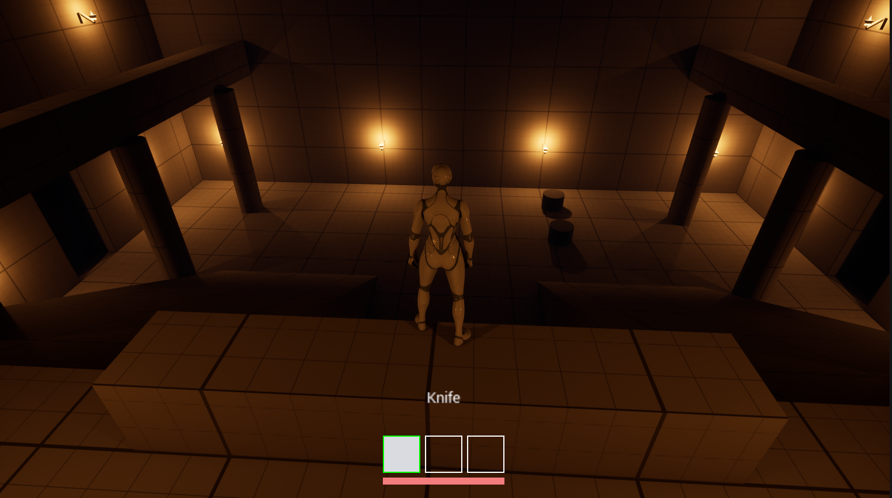
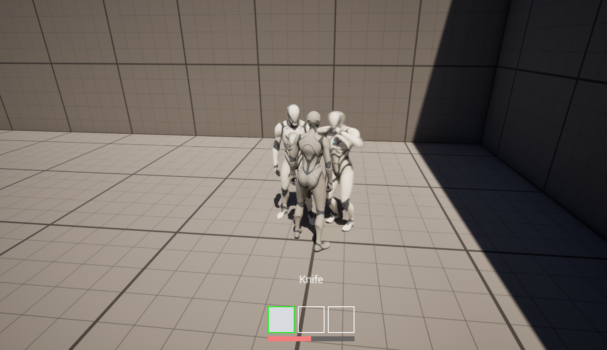
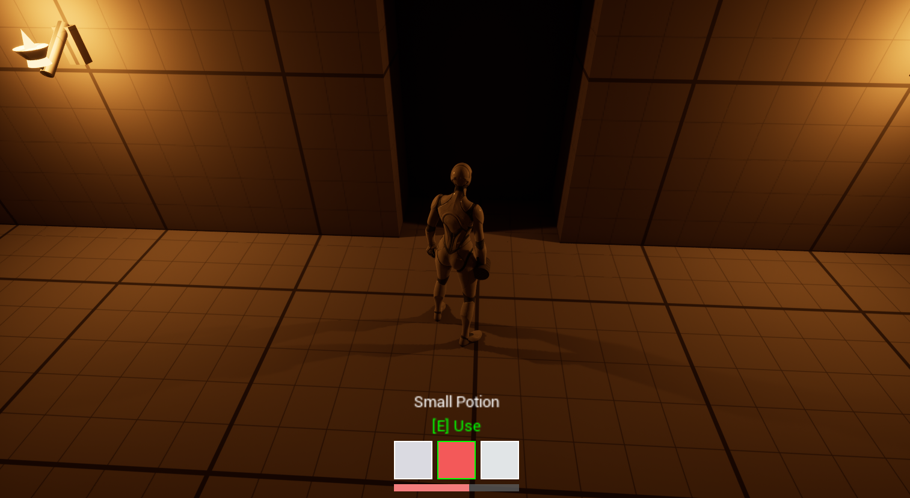
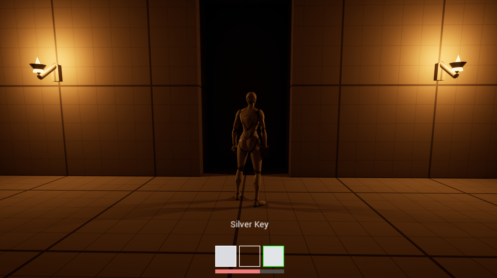
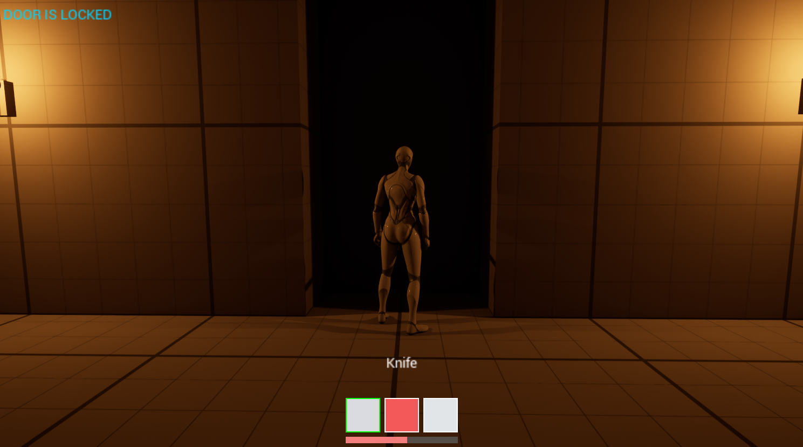
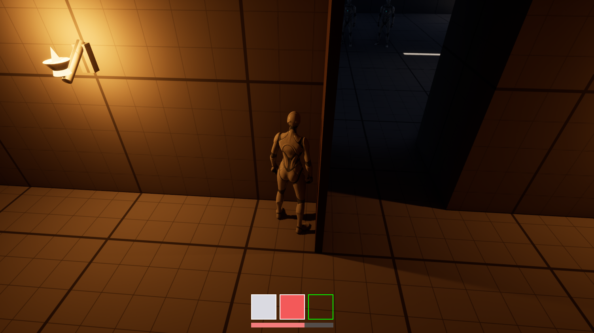

# 9일 동안 만든 것

**중세 성 액션 방탈출 · UE 5.8 · 1인 · 블루프린트 기반**

로비에서 시작해 **방 셋을 차례로 클리어**한다. 방에 들어가면 문이 봉인되고,
그 안의 적을 전부 쓰러뜨려야 **다음 방의 열쇠**가 떨어진다. 셋을 다 열면
2층 최종 문이 열리고 엔딩 구역으로 간다. 방 안에서 죽으면 **그 방만 초기화**되고
로비에서 다시 시작한다.

조작은 이동 · 점프 · 시점 전환(`V` — 3인칭 ↔ 1인칭) · 습득(`F`) ·
슬롯 선택(`1`/`2`/`3`) · 사용(`E`) · 버리기(`Q`) · 공격(`LMB`).

2025년 팀 프로젝트의 T자 성 구조를 UE 5.8에서 혼자 다시 짓고,
**인벤토리 · 문과 열쇠 · 적 AI · 근접 전투 · 스테이지 진행 · 중세 조명**까지
한 바퀴 돌려 **처음부터 끝까지 플레이되는 상태**로 만들었다.

---

## 레벨 — `Lvl_Stage`

원본 도면의 T자 구조를 옮겼다. World Partition + One File Per Actor.

| | **방 2** · `10 × 8`칸 | |
|---|---|---|
| **방 1** · `9 × 8`칸 | **로비** · `14 × 11`칸 `∩`자 2층 발코니 · 램프 2 · 기둥 6 | **방 3** · `10 × 8`칸 |

진행은 **로비 → 방 1(안 잠김) → 은열쇠로 방 2 → 동열쇠로 방 3**이고,
셋을 다 클리어하면 **2층 최종 문**이 열려 엔딩 구역으로 간다.

전체 `37 × 22`칸(1칸 `200`). 벽은 하단 `Z 0..200` · 상단 `Z 200..400`,
2층 벽 `Z 400..1200`, 발코니 걷는 면 `Z 600`, 램프 경사 `31.0°`.
지오메트리는 전부 큐브 · 램프 · 실린더를 늘린 것이다.

## 시스템

| | 핵심 |
|---|---|
| **인벤토리** | `S_ItemDef` 구조체 + `E_ItemNature` 열거형 + `DT_Items` **6행**. 슬롯 3칸, 개수는 `SlotCount` 변수 하나. **선택이 곧 장착** |
| **상호작용·문** | `BPI_Interact` 인터페이스 하나. 문도 아이템도 **같은 라인트레이스 한 경로**. 상태 셋 — `bLocked` · `bOpen` · `bSealed` |
| **적 AI** | `BP_Enemy` **한 클래스**. 시야각 + 라인 오브 사이트로 벽 너머 감지 차단, 추격 · 복귀 · 방 소속 |
| **전투** | 몽타주 노티파이로 타격 창을 열고, **칼날/주먹이 지나간 궤적을 스윕 트레이스**. 한 스윙에 같은 대상은 한 번만 |
| **진행** | `BP_StageRoom`이 자기 방의 적을 세고 열쇠를 떨군다. 방에 들어가면 문이 봉인되고, **그 안에서 죽으면 그 방만 초기화** |
| **플레이어** | `V`로 3인칭 ↔ 1인칭 전환(카메라를 `head` 본에). HP · 피격 · 사망 · 리스폰 |
| **HUD** | **UMG 위젯을 하나도 안 만들었다.** `AHUD` 캔버스로 슬롯 · HP 바 · 아이템 이름 · 프롬프트 · 안내 메시지를 전부 그림 |
| **아트** | 석재/목재 재질, 횃불 액터 `BP_Torch` **18개**, 로비 천장. 기성 에셋 없이 기본 프리미티브로 조립 |

---

# 데이터가 규칙을 만든다

**한 벌의 HUD 코드와 한 벌의 문 코드가, DataTable 행에 따라 다르게 동작한다.**
아래 네 장은 같은 시스템의 서로 다른 입력이다.

| | |
|---|---|
|  |  |
| `Small Potion` — 칸이 **빨강**, **`[E] Use` 표시** | `Silver Key` — 칸이 **은회색**, **`[E] Use` 없음** |
|  |  |
| 칼을 든 채 문 앞 → **`DOOR IS LOCKED`**. 3번 칸에 은열쇠가 **그대로 있다** | 은열쇠를 선택하고 같은 문 → **열림**. 3번 칸이 **비었다** |

## 무엇이 데이터에서 오는가

| 화면에 보이는 것 | 출처 |
|---|---|
| `Small Potion` · `Silver Key` | `DT_Items`의 `displayName` |
| 칸의 빨강 · 은회색 | 같은 행의 `iconColor`. `Silver Key`는 `(0.75, 0.78, 0.8)` |
| `[E] Use`가 뜨고 안 뜨는 것 | `E_ItemNature` — `Consumable`은 뜨고 `Key`는 안 뜬다 |
| 문이 열리고 안 열리는 것 | `BP_Door.RequiredKey`와 **선택된 칸**의 RowName 비교 |
| 열쇠가 사라진 것 | `TryConsumeSelected`가 칸을 비우고 `RefreshHeldItem` |

**아래 두 장이 규칙 하나를 보여준다** — 가방에 열쇠가 있어도 **선택하지 않으면 열리지 않는다.**
좌하의 3번 칸에 은열쇠가 보이는데 잠겨 있고, 우하에서 그 칸을 선택하자 열리고 소비됐다.

## 2025년과 무엇이 다른가

| 2025 | 2026 |
|---|---|
| 아이템 **한 종**(열쇠), `Item_Name` 문자열 비교로 식별 | **6행 DataTable** + RowName |
| 슬롯 2칸을 `Switch on Int` 0/1로 하드코딩 | `SlotCount` **변수 하나** |
| 문마다 전용 클래스(`Stage2Door`)가 GameMode를 직접 캐스팅 | `BP_Door` **한 클래스**, `RequiredKey`를 인스턴스에서 지정 |
| 상호작용 경로 둘 (문=트레이스 / 아이템=오버랩) | **경로 하나** |

**아이템을 한 종 늘리려면 2025년에는 코드를 고쳐야 했고, 지금은 행을 하나 추가하면 된다.**
